# MyWealthPath Application 

This project consists of three related applications intended for use by a fictitious financial investment company, MyWealthPath. The applications are:

* Company website developed using a React framework which is intended to provide prospective clients with information about the investment company and allowing them to request additional information using a contact form.  In addition, the website contains links for existing clients and MyWealthPath financial advisors to access their respective company dashboards

* Streamlit application serving as a placeholder and development environment for both the client and financial advisor dashboards. Each respective dashboard demonstrates a set of basic functions intended to facilitate the transfer of funds between the client and company.

* Holoviz Panel dashboard which provides potential clients with details on the investment options available through MyWealthPath based upon their personal Risk Profile Score. 

A blockchain smart contract written using the Solidity language provides the backbone for the contact form as well as for the financial transactions between the client and company.

And a more detailed presentation can be found [Here](./MyWealthPath_Project_3.pptx).  

---

## Technologies

Blockchain functionality is provided by code written in [Solidity](https://soliditylang.org). The local testing network relies upon the [Remix IDE](https://remix.ethereum.org/), [Ganache](https://trufflesuite.com/ganache/) and [Metamask](https://metamask.io).

The MyWealthPath website was built using the [React](https://react.dev) library and is dependent upon the [Node.js](https://nodejs.org/en/about) JavaScript runtime.

The mockup for client and advisor dashboard functionality utilizes the [Streamlit](http://streamlit.io) platform.

The MyWealthPlan Investment Platform is written in Python and uses the [Panel](https://panel.holoviz.org/index.html) dashboarding solution to present information to the user. 

Visualizations are provided by the [Bokeh](https://bokeh.org), [hvPlot](https://hvplot.holoviz.org) and [Matplotlib](https://matplotlib.org) libraries. 

Details on asset performance are retrieved using the [Yahoo Finance](https://finance.yahoo.com) API.

Performance indicators are calculated using the [Pandas TA](https://twopirllc.github.io/pandas-ta/#dataframe-methods) library.

The [Pandas](https://pandas.pydata.org) and [Numpy](https://numpy.org) libraries are used to work with the asset data retrieved from the API.

For the Machine Learning Models training, testing and selection, the [scikit-learn](https://scikit-learn.org/stable/index.html) and [TensorFlow](https://www.tensorflow.org) libraries are used.

Hyperparameter tuning of the TensorFlow models was accomplished using [KerasTuner](https://keras.io/keras_tuner/).

---

## Installation

### Blockchain 

In order to make use of a local blockchain, which is required for the contact form and client/advisor dashboards, the following must be available/installed:
* Access to the [Remix](https://remix.ethereum.org/) online IDE for Solidity development
* A personal/test Etherium blockchain for contract deployment. Development was done using [Ganache](https://trufflesuite.com/ganache/) and all documentation and examples assume it's usage. OS specific installers are available on the Ganache website.
* A crypto wallet to connect to the blockchain. Development was done using [Metamask](https://metamask.io/). All documentation and examples assume it's usage. Browser extensions for many popular browsers can be downloaded from the Metamask website.

### Node.js

Node.js is required for the functioning of the company website. Development was done using Node.js verison 18.  Other versions may work, but no guarantee is made.

You can verify if Node is installed on your system and determine which version by executing the following command

```
node --version
```

If necessary, you can download an installer from the [Node.js website](https://nodejs.org/en).  Mac and Linux users may also use [Node Version Manager (nvm)](https://github.com/nvm-sh/nvm) while those on a Windows platform may use [NVM for Windows](https://github.com/coreybutler/nvm-windows). The use of nvm and nvm-windows is beyond the scope of this project and is you are unfamiliar with node.js we suggest using the installer found on the node.js website.


### Python Environment

The Panel and Streamlit dashboard applications were developed using python version 3.9.16. Other versions of python may work, but no guarantee is made. We suggest usinig a new virtual environment with the correct version of python.

The following python packages must be installed to run the application locally:
* pandas
* panel
* bokeh
* matplotlib
* yahoo_fin
* numpy
* hvplot
* tensorflow
* keras-tuner
* pandas_ta
* jupyterlab (only if the .ipynb file is used. running the .py file does not require jupyterlab)
* questionary
* web3
* streamlit

These packages may be individually installed into the environment of your choice or you may create a new conda environment using the included environment.yml file. 

```
conda env create -f environment.yml
```

If you prefer using pip, the included requirements.txt file may be used to install the required packages.

```
pip install -r requirements.txt
```
---

## Setup

Prior to the initially launching the set of applications, the following setup actions must be taken.

### Data Preparation

Rather than continually make API calls and perform calcuations when data only updates on an at most daily basis, the application relies on preprepared data and images. As such, it is recommended to refresh these data sets and images on a periodic basis,such as weekly or monthly, in order to present more current and relevant information.

You may refresh the data at anytime by running the script provided in the scripts directory:

```
python create_data_files.py
```

Do the the volume of data and images being prepared, this process can take some time so please be patient when choosing to refresh.


Do to the usage of joblib dump/load for the persistence of the models and some data you may encounter compatability issues, most especially if you are not using the recommended python version. If this is the case, you can recreate the machine learning models and then follow the above instructions for refreshing all data files.

To recreate the machine learning models please run the save_best_models.py script found in the scripts folder.

```
python save_best_models.py
```

Alternatively, you may run the save_best_models.ipynb notebook in jupyter lab


### Install Node.js modules

After installin node.js and prior to launching the React website you will need to install the necessary node modules. To do so, navigate into the react director and run the following command;
```
npm install
```

This step only needs to be done once, not upon each launch of the application.

---

## Launching

In order to launch the MyWealthPlan applications, the following steps should be followed:

### Setup local blockchain

For setting up a local blockchain using remix, ganache and metamask:

* Go to the [Remix](https://remix.ethereum.org/) IDE and open the project folder by importing it.

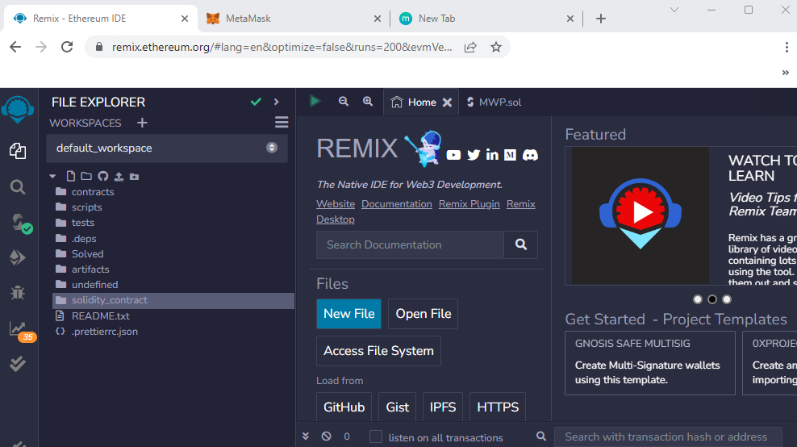

* Download [Ganache](https://trufflesuite.com/ganache/), create an account and open a ethereum Workspace on it:

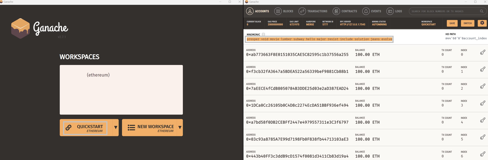

* Install [Metamask](https://chrome.google.com/webstore/detail/metamask) on your browser. Then go to "Unblock", introduce the 12-word mnemonic key provided in your Ganache workspace and set a password:

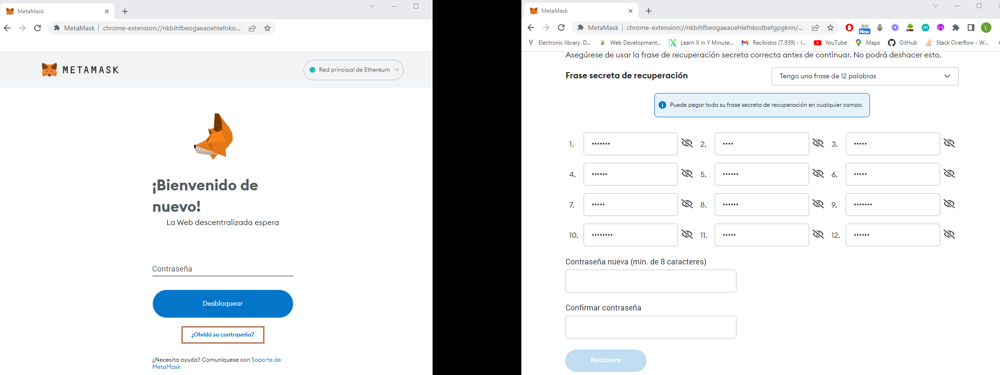

* Then go to Metamask and create a new account linked to your Ganache workspace as follows:

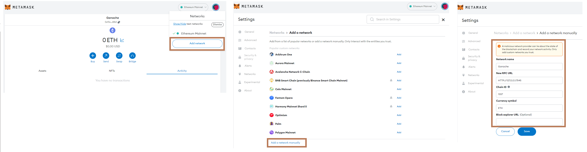

* Back in Remix, open the ```MWP.sol``` contract contained on the ```solidity_contract``` folder and compile it to check the absence of errors and get the ABI:

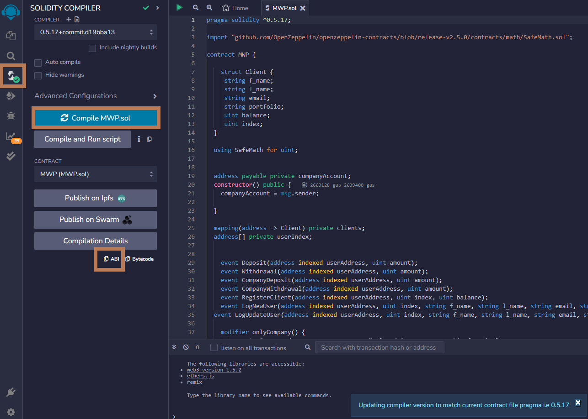
 
* On the Deployment section in Remix, choose Metamask as 'Injected Provider', click 'Deploy' and the Metamask interface should open for connecting:

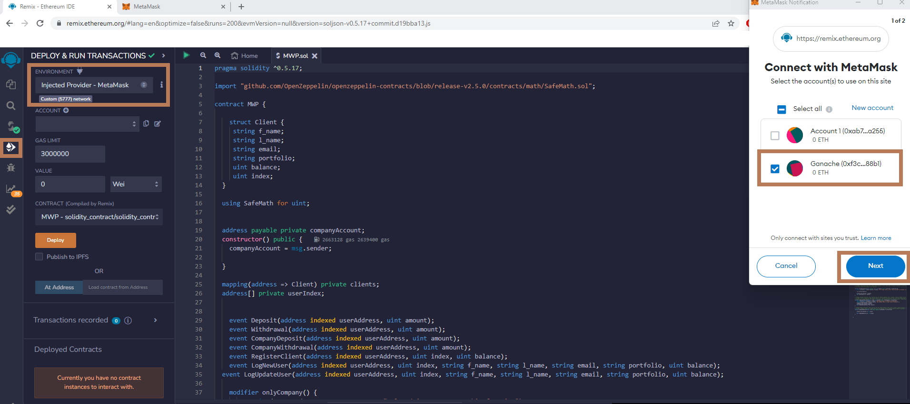

* Finally, Deploy the contract by clicking the "Deploy" button in Remix, accept the transaction costs that will pop on Metamask, and the contract address will be generated:

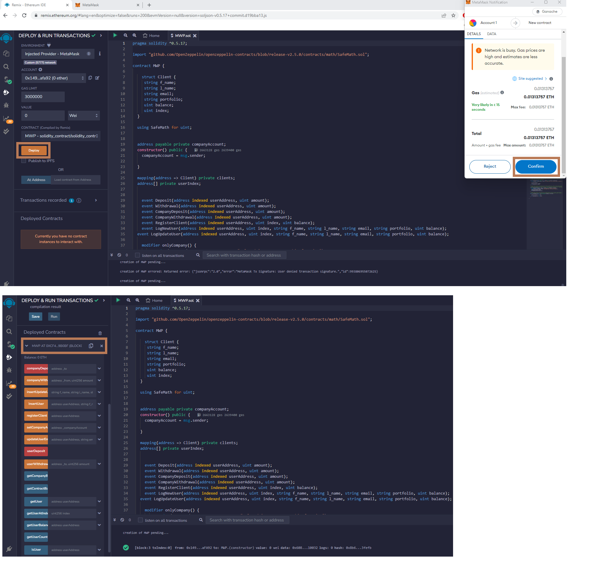

Please be sure to have your Ganache URI available as well as the deployed contract address and address of the account you deployed the contract with as you will need those during the launch process.

If you updated the smart contract you will need to copy the new ABI configuration and replace the contents of the /solicity_contract/abi.txt file with the updated configuration.

### Launch Applications

In order to simplify the creation of the testing environment a launch.sh script has been provided which is the recommended way to proceed.

The three applications may be launched individually if there is need, such as using alternative IP Addresses from those set with the launch script.

See below for instructions on both launch methods.

#### Launch Script

In order to simplify the creation of the testing environment a launch.sh script has been provided. Before launching the script, please be sure to have your contract address available as well as the address for the account you deployed the contract with as you will need to enter them during the launching process.

The launch.sh script can be found in the 'scripts' folder and can be launched by running the following, being sure you have already activated a compatable python environment:

```
bash launch.sh
```

You will be asked to confirm that either no changes were made to the MWP.sol contract file or that you updated the updated  the /solidity_contract/abi.txt file with the new ABI configuration.

Next, you wil be asked to provide the contract address.

Finally, you will be asked to confirm if Ganache is running at the default URI address

At this time the necessary configuration files will be created in the appropriate directories and the three applications will be launched using the following IP addresses:

| Application           | URI            |
|-----------------------|----------------|
| React                 | localhost:3000 |
| Panel Dashboard       | localhost:9501 |
| Streamlit Application | localhost:8501 |


When ready, the applications can all be terminated by issue a CTRL-C command in the terminal window where you ran the launch.sh script.


#### Manual Launch

To launch the project components manually, follow the steps outlined below. Each application should be launched from within it's corresponding directory.

1. Activate a compatable python environment

2. Launch the Panel Dashboard, making note of the assigned IP address
    ```
    panel serve --port <<desired port>> mywealthpath.py
    ```
3. Launch the Streamlit appliction, making note of the assigned IP address
    ```
    streamlit run streamlit_interfaces.py --server.headless true --server.port <<desired port>>
    ```
4. Run the setup.py file found in the /scripts folder. This script will prompt you for necessary information to create configuration files needed by the project components
    ```
    python setup.py
    ```
5. Launch the React website
    ```
    npm run start
    ```

At this point all components of the project are running, although only the website has been opened in a browser. The Panel Dashboard and Streamlit application can be launched from the links found on the website. Alternatively, you may launch them manually using the assigned IP addresses.

---

## Usage

### React Website 

The node.js supported website serves as the hub of the project components. This site is intended to be a public-facing resource for potential clients to obtain information regarding the services and history of the fictitious investment services company MyWealthPlan.

Upon launch, a simple landing page is provided containing the items described below:

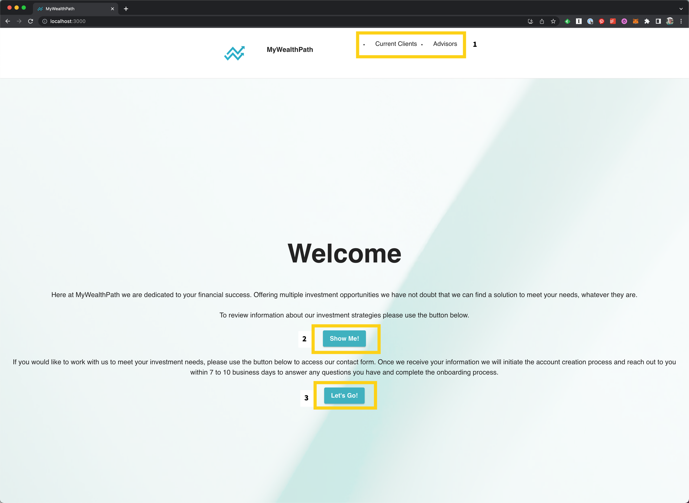

1. Links intended for current clients or company employees to take them to their respective dashboards for account activities, such as deposit/withdrawal of funds.  For development purposes both links access the Streamlit app which will provide test functionality of the transaction functions available in the Solidity contract.

2. Link that opens the Panel Dashboard app, which serves as a marketing/infomrational tool for the company, allowing it to showcase it's investment options and performance to prospective clients.

3. Link that launches a Client Engagement Form, which is used to obtain contact information about potential clients and begin the onboarding process.  The form uses the Solidity contract as the processing and storage engine. The contact form is shown below, along with descriptions of its basic funtions:

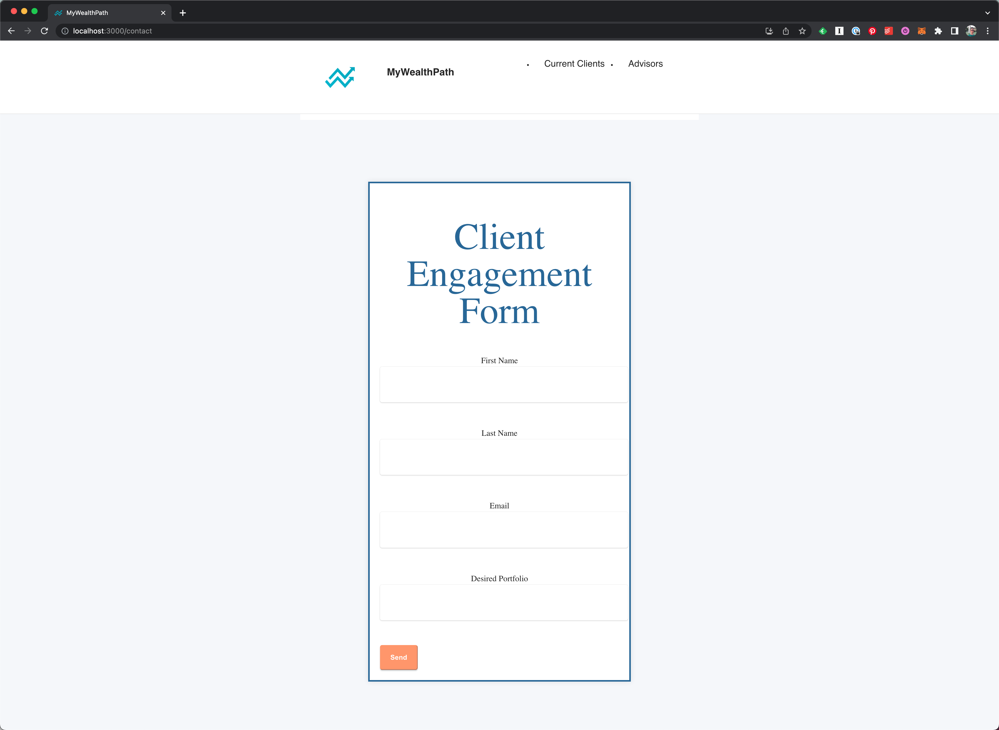

Once the form is completed and the submit button clicked, the MetaMask extension will open allowing the user to complete the submission process.

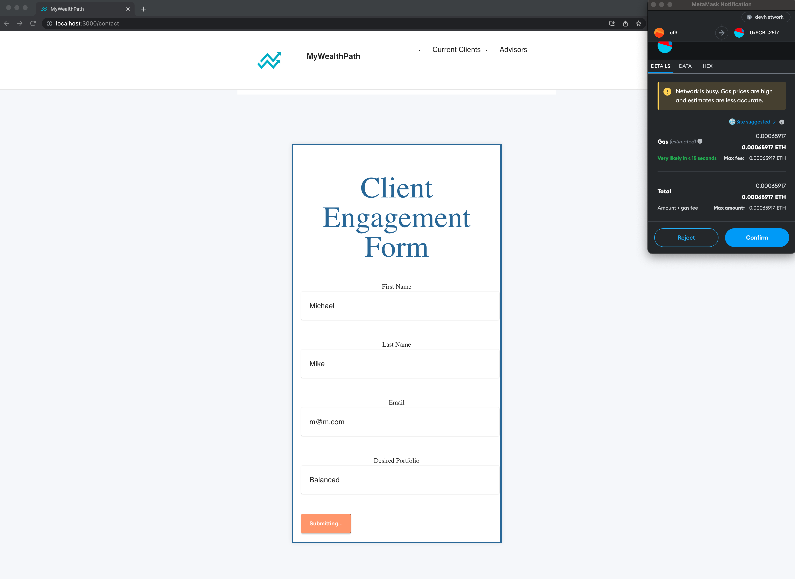

 The users public address is used as the key for storing the submission data, so in order to test multiple submissions it is necessary to switch between test accounts, being sure that each is connected to the website correctly. 
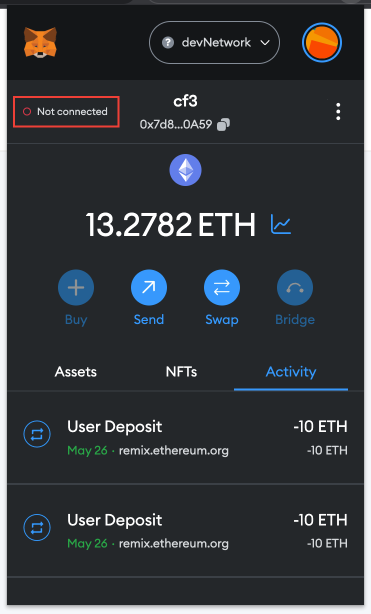

If not connected, the connection status can be clicken on and then the 'connect' option selected from the next page display

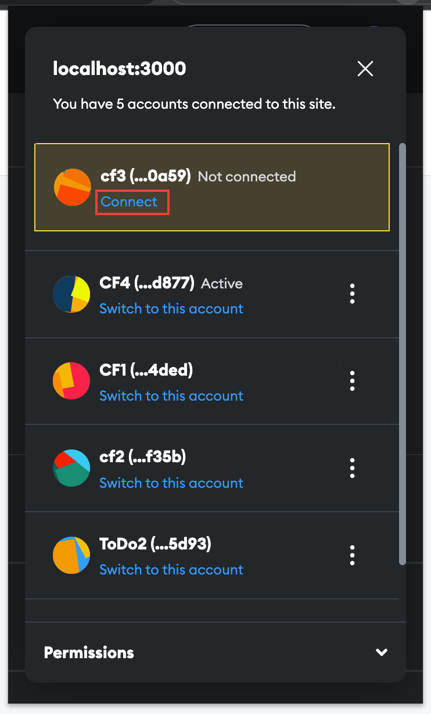

Once successfully submitted, the user will be shown a confirmation page:

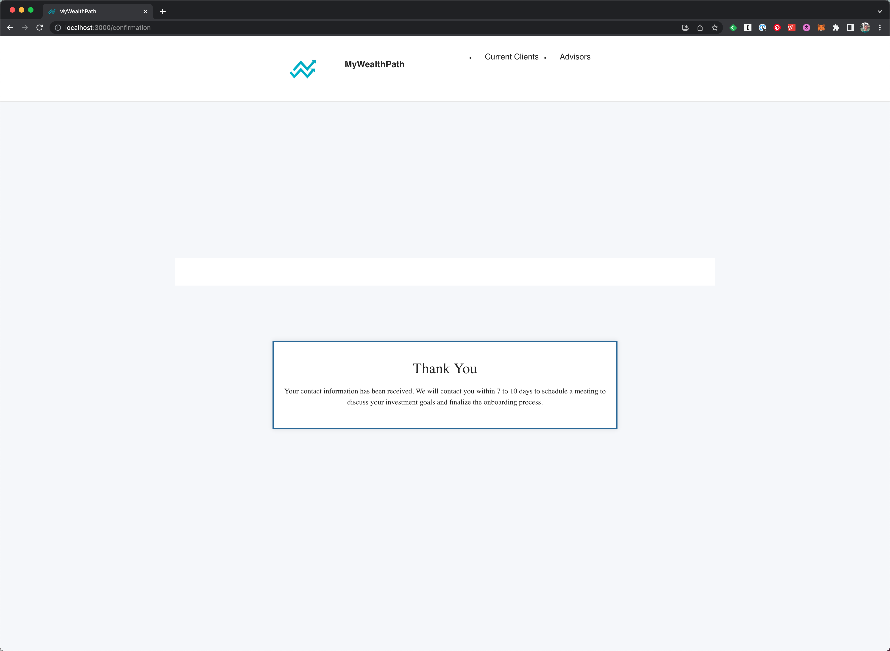

### Streamlit Application

The Streamlit application is a development environment for designing and testing the functionality for the deposit/withdrawal of funds in a client's reserve fund with MyWealthPath, as well as allowing an employee to access contact information about a client. The transactions are all conducted using the Solidity contract.

Prior to utilizing the page at least one client engagement form should be submitted in order to populate the client account list in the Solidity contract.

The Streamlit application consists of two pages, one for the client functionality and one for the advisor/employee functionality. The radio buttons in the left-hand column are used to toggle between the two pages. Functionality for each page is explained below:

#### Client Portal

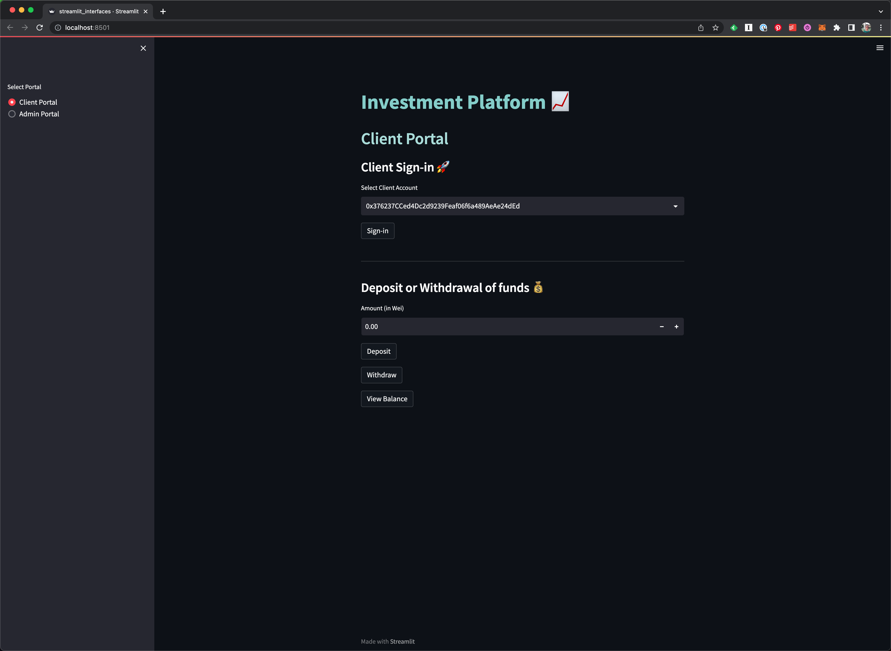

For testing purposes, all addresses available in the running Ganache envrionement area provided in a select box. Only those addresses that have been saved in the smart contract have access to the functions on the page. An address is saved in the smart contract by submitting a Client Engagement Form using that address.

The client page has a mock-up 'Sign In' function that verifies the user is a current client. Client status is based upon the user's public wallet address being saved in the smart contract.

Clients are presented with three options:
1. Deposit
2. Withdraw
3. View Balance

The Deposit and Withdraw functions rely on the value in the 'Amount' text box. The funds are transferred between the client's crypto wallet and their account within the smart contract.


#### Advisor/Admin Portal

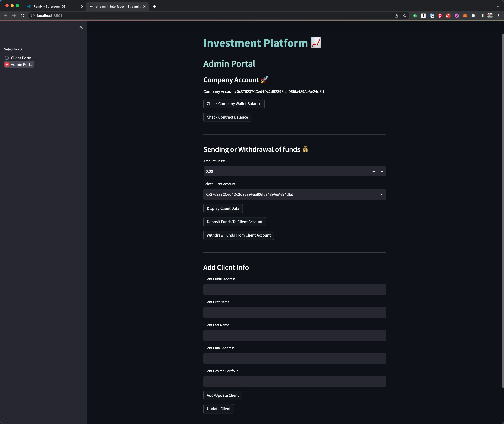

The Admin portal allows a company employee to view the balance in the contract and in the company's crypto wallet.

In addition, it allows the company to lookup contact details about a client based upon their public address. 

The company is able to transfer funds from the client into the company wallet, where it would be used for investment into the client's chosen portfolio. The company may also deposit funds back into the client's account within the contract, such as after divesting from a portfolio in whole or in part. 

Finally, the company employee can use the 'Add Client' and 'Update Client' features to either add a new client to the Solidity contract or to update the name/email/portfolio choice of an existing client.


### Panel Dashboard
The left-hand portion of the dashboard consists of a six-question risk tolerance questionnaire. Once the questions are answered and the submit button is clicked the a risk tolerance score will be calculated for the user and they will be assigned a risk tolerance category. 

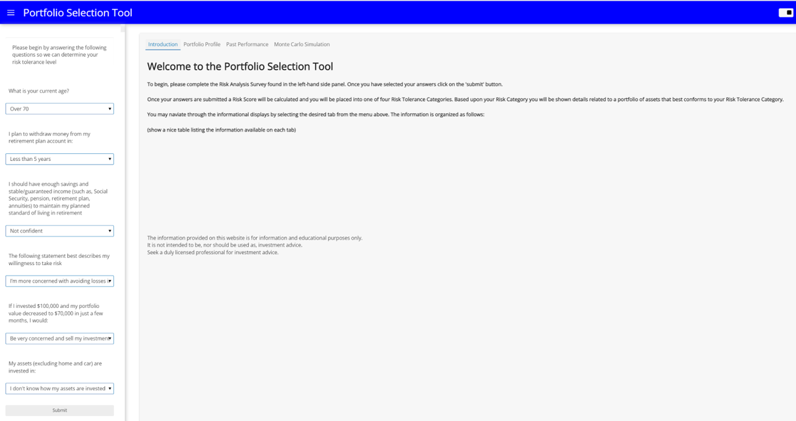

Once determined, the risk tolerance category is used to assign the user to one of five predetermined portfolios that vary in their overall level of investment risk. Details on the assigned portfolio are provided in the tabs found in the upper-right-hand portion of the dashboard. The following information will presented to the user:

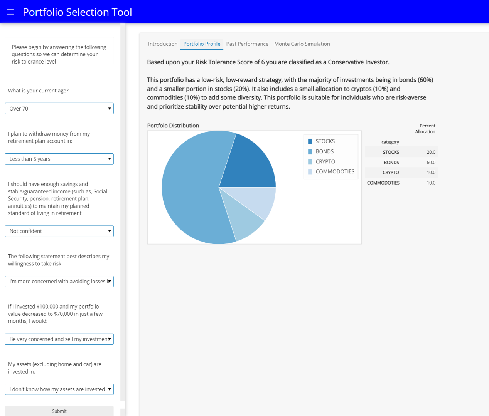

Then the client can go to the 'Past Performance' tab where a deeper analysis of past performance and Benchmark vs Market are provided for their chosen portfolio:

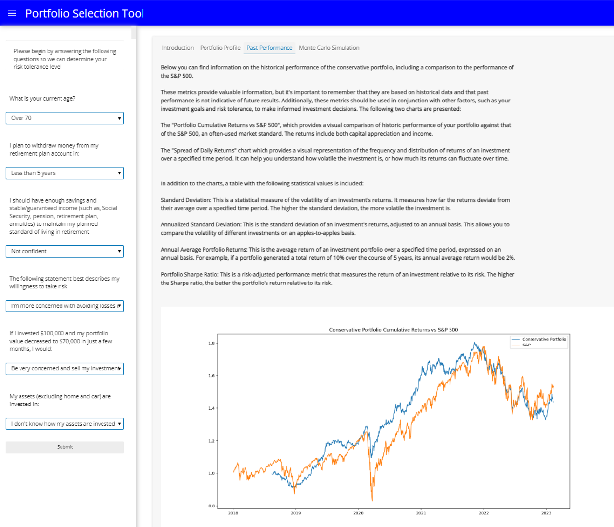

On the next tab, a 10 years Monte Carlo Simulation can be launched in order to get a lower and upper range for the expected performance with a 95% confidence interval:

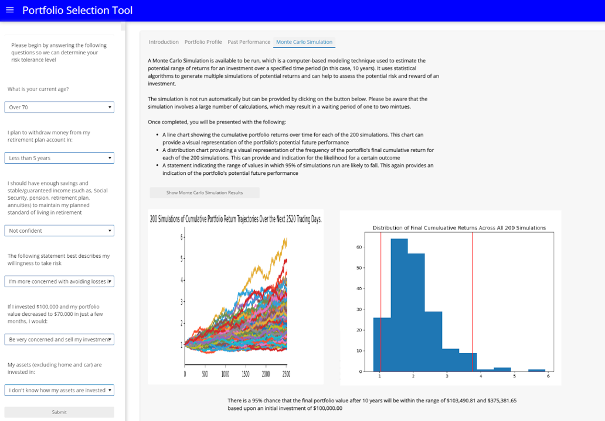

Lastly, on the **'Algortihmic Trading' tab**, the user can select a Trading Strategy and a backtest of it's performance will be displayed (vs the plain 'buy and hold' Portfolio and vs the S&P500 as Market reference). The tool will also choose the best performing ML Model among 7 different models (and 11 parameter variations within each of them).

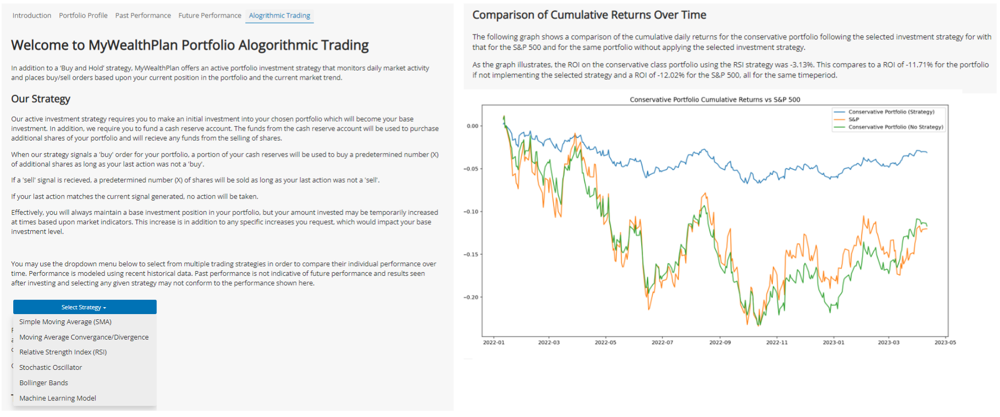

It will also show Monte Carlo simulations for the strategy:

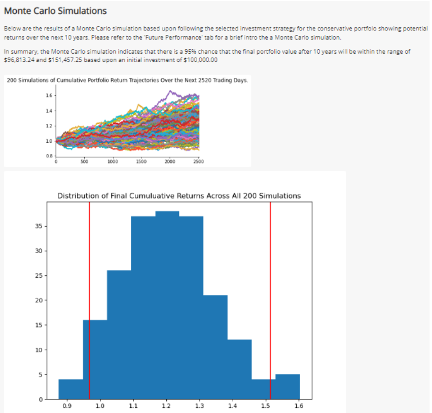

With all this information, the Client can clearly see both the past and predicted performance of the base Portfolio (buy and hold) assigned to their risk-aversion level, its performance if they add an 'enhancing' trading strategy, and the benchmark/comparison against a widely used Market reference.

---

## Contributors

[Ahmad Takatkah](https://github.com/vcpreneur)<sup>1</sup>     
[Lourdes Dominguez Bengoa](https://github.com/LourdesDB)  
[Patricio Gomez](https://github.com/patogogo)  
[Lovedeep Singh](https://github.com/LovedeepSingh89)  
[Thomas L. Champion](https://github.com/tlchampion)  

---

## License

License information can be found in the included LICENSE file.

---

## Credits
* Risk Analysis Survey was compiled based upon a survey provided by [Lincoln Financial Group](https://bit.ly/3InwBMP)
* Code for generating the Monte Carlo Simulation was modified from code provided by UC Berkeley Extension FinTech Bootcamp

___

## Future Work

Future work and/or enhancements to this project include:
* Implementing a more robust Risk Analysis Survey
* Revamp model training and evaluation to find better performing options
* Adding in features to allow a user to fine-tuning their portfolio
* Improve visualizations
* Enhance UI/UX
* Incorporate Streamlit functionality into the node.js-based website

---

## Disclaimer

The information provided through this application is for information and educational purposes only. 
It is not intended to be, nor should it be used as, investment advice. 
Seek a duly licensed professional for investment advice.

---


<font size = "1"> 1 Ahmad contributed to the initial design of the platform (Stage 1), but was unavailable for continued development </font>


